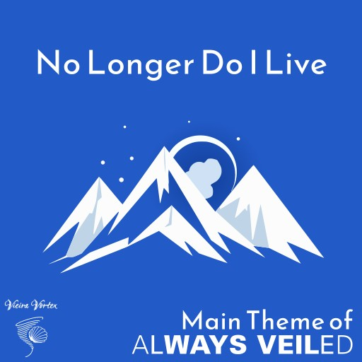

# No Longer Do I Live

- **Debut:** March 2025
- **Media:** [*Always Veiled*](../alwaysveiled.md)
- **Genre:** Hard rock
- **Publisher:** [*Vieira Vortex*](../vieiravortex.md)

"No Longer Do I Live" is the main theme song of [*Always Veiled*](../alwaysveiled.md). It is a hard rock song. The remixes lean towards a more ambient influence.

## Versions

- **Original Version** - Only appears on Bandcamp and SoundCloud. It is basically the same as the video version, but it does not have the opening and closing storm sounds.
- **Video Version** - The version that actually appears in song trailer on YouTube. It has an extended intro and an ending that includes thunderstorm sound effects.
- **A Strange Divide Mix** - A version that completely removes the guitar part, but at the same time increases the percussion and adds a vinyl effect to the sound. Only available on Bandcamp and Soundcloud.
- **Etched in My Soul Version** - A version in which percussion is completely excluded, and, like in the previous mix, a vinyl effect is added. Only available on Bandcamp and Soundcloud.

## Lyrics

The first time you appeared in my life,
It felt so strange.
A girl with dark hair,
Doing things so out of range.
But I was broken inside, so lost and alone,
I followed you blindly.
Now you’re etched in my soul, how can I forget you?

It’s not easy, no!
Your eyes, your lips, they're all I ever know!
And I can’t stop thinking how it could be,
With you by my side, though it's all fantasy.

A strange divide happened deep in my heart,
From the moment I knew you, everything fell apart.
No longer do I live just to pass the time,
But for the dream of seeing you, making you mine.
How can I forget you? It’s not easy, no.

Your eyes, your lips, they're all I ever know!
And I can’t stop thinking how it could be,
With you by my side, though it's all fantasy.
Though it's all fantasy.
Though it's all fantasy.
text

## Connection to the Game

The song is sung from the perspective of Lyne, who, as one of the game's protagonists, meets Molly, and this meeting causes him to take care of her, which leads to unpleasant consequences for him.

## Trivia

- An almost identical version of this song can be found on the internet under the name "All for Asia", the only difference being the different vocals and the fact that it has a "fading out" instead of a "cold ending". It also has an identical cover with a snow peak on a blue background. Apparently, the song was dedicated to a certain Asia Vieira.