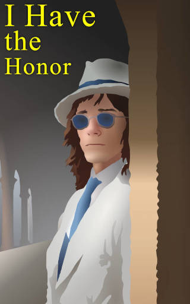

# I Have the Honor

- **Publisher:** [*Vieira Vortex*](../vieiravortex.md)
- **Release:** May 2025
- **Genre:** Drama, Romance
- **Issues:** One-shot

"I Have the Honor" is an another entry in the series of novels based on [*Always Veiled*](../alwaysveiled.md). This is essentially the backstory of the [*prototype 18.05.1982*](../prototype.md).

The story of "I Have the Honor" was written in early May 2025, and coincides with the work on the game prototype itself. Its canonicity may be questionable due to the introduction of some characters and concepts not mentioned in the prototype's limited lore. However, its plot does feature an important character such as Parvis.

## Synopsis

"I Have the Honor", like "The Good Daughter", is divided into two parts, but unlike the previous novella, the second part logically continues the first, and does not ignore its events.

The first part, entitled "Lepidoptera, Pieridae", tells the story of 27-year-old Parvis, who is traveling by train to his fiancée's home, reading Sue Miller's "The Good Mother". When there are no more than 20 minutes left before the final stop, a stranger suddenly enters his compartment, who, after exchanging a few words with the stunned hero about future generations, jumps out of the window, after which the door to the compartment is broken down by men in uniform, to whom Parvis responds with the words of the stranger, which became the title of the part.

In the second part, entitled "A Deer Decides to Become a Lion", Parvis arrives in town and immediately makes an appointment with his fiancée's brother, Walton, in the park, where he shows him the forbidden documents hidden in a book. They are distracted by an ice cream man, and because of this, Parvis forgets the book on a bench. Upon arrival at the fiancée's house, Parvis goes with her to catch butterflies, and upon returning, he sees the fruits of his mistake - the gendarmes who had been following them in the park have arrived at their house and arrested Walton. His sister, in despair, tells Parvis that "he is not a man," and the young man, in an attempt to prove to the fiancée that he is worth something, takes her revolver in order to free her brother.

## Characters

- **Parvis** - A 27-year-old man who dresses to the nines and is too superficial about the world around him. However, when his fiancée's brother is arrested because of him, he decides to justify his frivolity to the girl by planning to save her brother.
- **Walton** - Parvis's fiancée's brother, who is probably the same age as the protagonist himself. He is his friend from university and, apparently, is involved in political squabbles, into which he indirectly dragged Parvis by asking him to give him some forbidden documents that were hidden in Sue Miller's book "The Good Mother". Due to Parvis's fault, he is arrested by the gendarmes.
- **Parvis's Bride** - Walton's younger sister, who lives with him and her mother in the country. She loves butterflies, like Parvis himself, but when he causes her brother's arrest, she becomes disgusted with the hobby. It is noted that she keeps a lady's revolver in her room.
- **Parvis's Aunt** - an older woman sent by Parvis to visit his fiancée's family before his arrival. According to Walton, Parvis' aunt irritates their mother by advertising Parvis as his sister's fiancé.
- **Mother of the Parvis's Bride** - a woman who lives in the country with her daughter and son (Parvis' fiancée and her brother Walton). She does not approve of Parvis as her daughter's fiancé, and when Parvis' aunt visits their home (which was planned by Parvis himself), she begins to predict misfortune for her son-in-law.

## Significance

This novel is a prequel to the world of the game prototype, detailing the protagonist Parvis and the conflict that led him to the events that take place in the game. The work gives an idea of ​​the character of the hero, describes the world around him, and also gives an idea of ​​the people through communication with whom he comes to the final conclusion. The story told allows us to understand what factors led the hero to make the decision that he makes in the game prototype.

## Trivia

- In the introduction, the phrases of the stranger who entered Parvis's compartment are completely identical to those shown on the screen when trying to exit the prototype. In fact, the task of the prologue was to present "bare lines" in the context of the story.

- The book that Parvis reads in the prologue, and in which, as it turns out, he smuggled in prohibited documents, is none other than Sue Miller's novel "The Good Mother". Notably, in Leonard Nimoy's 1988 film adaptation, Anna Dunlop's character's daughter, Molly, is played by Canadian actress Asia Vieira.

- The main character's name, Parvis, is taken from Stanislav Lem's last novel "Fiasco".

- The name of Parvis' friend, Walton, was chosen specifically to draw an association with Walter Sullivan from the cult video game "Silent Hill 4: The Room".