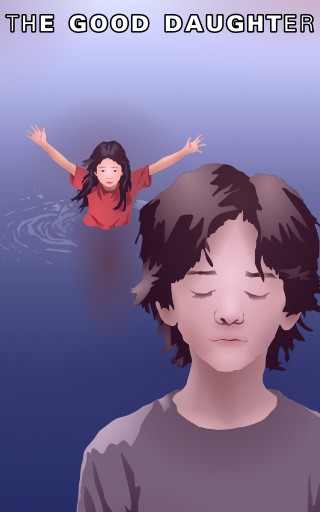

# The Good Daughter

- **Publisher:** [*Vieira Vortex*](../vieiravortex.md)
- **Release:** April 2025
- **Genre:** Drama, Romance
- **Issues:** One-shot

"The Good Daughter" is an entry into the series of novels based on [*Always Veiled*](../alwaysveiled.md). This is essentially the backstory of the game project.

The story of "The Good Daughter" was written in early April 2025 and precedes the start of work on the game project itself. Its canonicity is debatable due to the appearance of certain characters and concepts from those novel with little mention of game-specific lore. However, it does introduce important characters to the game, such as Molly and Lyne.

## Synopsis

"The Good Daughter" conceptually divided into two parts, the first of which is actually a prologue that has no particular relation to the main story.

The first part, titled "Before She Drown", tells the story of 14-year-old Anlá, the son of a fisherman. During a spring festival, while riding his boat down the river, he witnesses an eight-year-old girl who is participating in the festival fall into the water. Without hesitation, Anlá rushes to her aid, pulls her to shore, and, without expecting any praise or gratitude, returns to his boat.

The second part, entitled "Personal Magdalene", completely ignores the events described in the first and focuses on Lyne, a student in his twenties, who, on October 9, while sitting in his apartment, enviously remembers Cyrus, the lead singer of a rock band, whose performance he attended only three days ago. The hatred of this successful musician prompts Lyne to direct his negative emotions towards an object, and he ends up imagining in his apartment a little girl whom he considers his daughter, on whom he acts out his anger, transformed into a distorted love.

## Characters

- **Anlá** - A teenager who was swimming in a certain river during a spring festival. By chance, he became the unwitting savior of a little girl.
- **Lyne** - A young student, struggling financially and suffering from alcohol addiction, begins to indulge in irrational fantasies after meeting a rock musician who makes him envious, creating an image of a non-existent daughter. This behavior becomes an alarming signal about the possible development of schizophrenia.
- **Molly** - An eight-year-old girl who was rescued by Anlá and returned to her mother in the first story, and in the second appears as a fictional image created by Lyne in his dreams about his daughter.
- **Cyrus** - The lead singer of a rock band that performed a concert in the city where Lyne lived on October 6. He is presented as a successful person whose achievements make Line, who is in a difficult situation, envious.

## Significance

This novel is an introduction to the world of the upcoming game, in which the main characters - Molly and Lyne - are revealed in detail. The work gives an idea of their characters, motives and goals, and also outlines key moments of their further development. In addition, through the description of events and the surrounding environment, a general view of the world in which the characters live is created, with its social, cultural and political structure. The stories told allow us to understand what factors will influence the decisions of the heroes and their relationships, as well as the development of events in the future.

## Trivia

- The introduction of a boy saving a girl from the water was included to soften the main storyline, which involves a student suffering from schizophrenia. The episode was meant to provide contrast and make the depiction of such a complex and disturbing subject as mental illness more bearable, and to avoid the excessive darkness that might otherwise have arisen.

- The concept of "birth" from thought may be a reference to the thinking ocean featured in Stanisław Lem's novel ''Solaris''. In that work, the ocean, with the ability to perceive the memories of people at a research station, creates so-called "phantoms" - images based on the experiences and feelings of people remaining in its field of action.

- The names of Molly's teacher and classmates in the work were borrowed from Leonard Nimoy's film ''The Good Mother'' (1988). Notably, the book's title itself refers to this film, and both stories feature a heroine named Molly, played in the film by Canadian actress Asia Vieira. 

- Rock star Cyrus' name is a multi-layered reference, simultaneously reminiscent of the great Persian king Cyrus the Great and modern-day singer Miley Cyrus

- Lyne's name is a reference to the surname of famous director Adrian Lyne, whose works, in particular the film ''Jacob's Ladder'', had a significant influence on the development of the cult ''Silent Hill'' franchise.