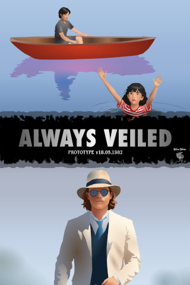

# Always Veiled (Prototype v18.05.1982)

**Developer**: [*Vieira Vortex*](../vieiravortex.md)

**Genre**: 2D side scroller  

**Always Veiled (*Prototype v18.05.1982*)** is the earliest known prototype of [*Always Veiled*](../alwaysveiled.md), released to interested parties outside of [*Vieira Vortex*](../vieiravortex.md). It is referred to as a "2D proof of concept" due to its graphics being rendered entirely in sprites. It was released on May 18, 2025, just two months into the project. It contains two rudimentary side-scrolling levels, showcasing features such as randomly generated enemies moving in different coordinates, a smoothly moving background texture (1 on the first level and 3 on the second), and sprites with multiple animation frames. The prototype's test controls allow for faster movement and diagonal shooting (on the second level).

## Plot

The narrative of this prototype, due to its limited gameplay, is not delivered through elaborate cutscenes but through brief, evocative story screens preceding each level, setting a distinctive tone that mixes heroism with mysterious undertones.

The River Level, titled "**The Good Mother**" in the menu, follows a 14-year-old boy named Anlá, who, while boating during the May 18th Festival, witnesses an 8-year-old girl, the daughter of one of the festival's participants, fall into the river. Ignoring dangers such as piranhas and sharp rocks, Anlá dives in to save her, driven by a sense of duty.

The second level, The Station Level, titled "**I Have the Honor**", is completely unrelated to the first story and moves on to a certain 27-year-old Parvis, who vows to free his friend Walton, who has been arrested by the gendarmes for possessing a banned book. Parvis embarks on a daring train hijacking, confronting the gendarmes and the driver in a volatile, authoritarian environment.

Adding to the strangeness, the "Quit Quiz" feature introduces strange dialogue (beginning with the cryptic words "*Lepidoptera, Pieridae. It called us.*") that seems unrelated to the plot of the game's levels, hinting at deeper, unexplained lore involving butterflies (which have no representation in the game itself) and historical musings. These narrative fragments, displayed upon exiting the game, feel like a rough draft of a larger story, leaving players intrigued but also puzzled by their suddenness and lack of explanation.

## Features

The prototype includes two distinct side-scrolling levels: the River Level and the Station Level, each with unique gameplay mechanics and narrative contexts. The River Level, set during a festival, tasks the player (controlling Anlá) with navigating a river to rescue a drowning girl, avoiding obstacles like rocks and enemies such as piranhas and indifferent boatmen. The Station Level, a more combat-oriented experience, involves Parvis hijacking a train to free a friend, progressing through three phases: Platform, Train Roof, and Machinist Cabin, where the player battles gendarmes and a final boss (the Motorman).

Key gameplay features include:

- **Player Movement and Controls**: Players can move left, right, up, and down, with a sprint mechanic (LShift) that increases speed by 1.5x. The Station Level introduces diagonal shooting (LControl with Up/Down keys), unique to its Platform and Train Roof phases.
- **Health and Invincibility**: Players have 10 health points, with a 0.5-second invincibility period after taking damage, accompanied by a blinking effect (alternating opacity between 255 and 128 every 0.1 seconds).
- **Randomized Enemy Spawning**: Enemies and obstacles are placed using a grid-based system with randomized coordinates, shuffled via a Mersenne Twister random number generator (std::mt19937). The River Level ensures at least one of each enemy/obstacle type (rock, fish, boatman) by replacing entities if necessary.
- **Level Progression and Win Conditions**: The River Level ends when the player reaches the goal (the drowning girl), triggering a win state after a 0.5-second blinking effect. The Station Level progresses through phases, culminating in pulling a lever in the Machinist Cabin to win.
- **Pause and Menu System**: Pressing Escape pauses the game, offering options to continue or return to the main menu. The menu supports navigation via mouse clicks, with a narrative "Story" screen introducing each level.
- **Quit Quiz**: A unique feature where selecting "Quit Game" initiates a four-step quiz with cryptic dialogue, closing the game only after completion. This adds an experimental narrative layer to the prototype.

The code, written in C++ using the SFML library, demonstrates a modular structure with separate classes for game logic (Game), rendering (Renderer), and level management (RiverLevel, StationLevel, Menu). The use of enums (GameState, StationPhase) ensures clear state transitions, while the Entity struct encapsulates sprite, animation, and physics data.

## Texture Cycling

Texture cycling is a core mechanic for sprite animations, implemented via the Entity struct's animationFrames vector, which stores pointers to sf::Texture objects. The Renderer::updateEntityAnimations function updates animations for the player, goal, enemies, and obstacles by incrementing a frame timer (animationTimer) and switching textures when it exceeds the frame duration (frameDuration). Frame durations vary by entity and state:

- **River Level**: Anlá's standing animation (0.5s per frame) switches between two textures (AnlaStand1Tex, AnlaStand2Tex), while swimming uses three textures (AnlaSwim1Tex, AnlaSwim2Tex, AnlaSwim3Tex) at 0.2s per frame. Fish enemies cycle two textures at 0.3s, and boatmen use three at 0.2s.
- **Station Level**: Parvis's walking animation (0.2s per frame) cycles three textures (parvisWalk1Tex, parvisWalk2Tex, parvisWalk3Tex), while shooting animations (parvisShootNormalTex, parvisShootUpTex, parvisShootDownTex) are single-frame with a 0.5s duration. Gendarmes and the Motorman boss follow similar patterns, with distinct textures for walking, shooting, or pushing.

Background texture cycling is achieved through two sf::Sprite objects (background, background2) positioned side-by-side, moving in sync with the player's velocity. When the offset (backgroundOffsetX) exceeds 1024 pixels (the window width), it wraps around, creating a seamless scrolling effect. The River Level uses a single river texture (riverBgTex), while the Station Level cycles three textures (trainBgTex, carriagesBgTex, driverscabinBgTex) corresponding to its phases.

The code efficiently manages texture loading in Game::loadResources, checking for file errors and logging successes (e.g., "Loaded texture Sprites/River/rock.png successfully"). Textures are scaled to fit the 1024x600 window, with the River Level's background scaled to match the window dimensions and the Station Level's sprites scaled down (0.5x) in Platform and Train Roof phases for a zoomed-out effect.

## Technical

The Always Veiled prototype is a fascinating glimpse into early game development, riddled with quirks and experimental choices that reflect its rushed two-month development cycle. Below are some of the most peculiar technical details uncovered in the codebase:

- The game generates an 8-character alphanumeric seed for its Mersenne Twister RNG, stored as a std::string and used to shuffle enemy positions. Bizarrely, the seed is never displayed or saved, and the setSeed function, while implemented, is inaccessible in the UI, suggesting an abandoned plan for seed-based level sharing.
- The camera system in Renderer::updateCamera offsets the player 300 pixels left of center to preview upcoming threats. However, in the Machinist Cabin phase, the camera is inexplicably locked to (512, 300), ignoring player movement, which can disorient players during intense boss fights.
- The Station Level’s phase transitions (Platform to Train Roof to Machinist Cabin) rely on static variables (rightmostEnemyIndex, phaseTransitionTimer) in StationLevel. If the rightmost enemy is killed, a 3-second delay triggers the next phase, but the system fails to account for edge cases where enemies are culled prematurely, potentially stalling progression.
- Enemy movement in the Station Level uses a complex y-coordinate selection algorithm to avoid clustering, choosing from four predefined heights (300, 350, 400, 450 pixels) based on occupancy. This overengineered solution contrasts with the River Level’s simpler boundary checks, suggesting conflicting design philosophies within the team.
- The game loads four distinct fonts (Univers 45 Light, Univers 75 Black, Univers 55 Roman, Futura Condensed Extra Bold) for minimal UI elements. The fontCondensed is used solely for the "Always Veiled" title and health display, an extravagant choice for a prototype with limited text.
- The codebase is littered with std::cout statements logging everything from entity spawns to menu clicks (e.g., "Drawing Paused at x=..., y=100"). These were likely intended for testing but remain in the release, bloating console output and hinting at a lack of polish.

## Trivia

- The River Level, titled **"The Good Mother"**, likely alludes to the 1988 Leonard Nimoy film of the same name. The sole connection lies in the drowning girl’s design—long black hair and a red-and-white striped shirt—mirroring Molly, the daughter of the film’s protagonist, played by Asia Vieira, hinting at a subtle nod to the actress.
- The prototype’s version number, 18.05.1982, coincides with Asia Vieira’s birthday, suggesting that the drowning girl in the River Level was modeled after her. This meta-reference weaves a peculiar link between the game’s fiction and real-world inspiration.
- In the Station Level, **"I Have the Honor"**, Parvis aims to liberate his friend Walton, imprisoned for owning a prohibited book. The book’s title and significance remain undisclosed, leaving players to ponder its mysterious role in the narrative.
- The "Quit Quiz," triggered by attempting to exit the game, forces players through four cryptic prompts, such as butterfly-themed riddles, where choices have no impact. This odd feature seems designed to impose a fragmented narrative perspective before the game closes, possibly as a developer’s cryptic farewell.
- The River Level unfolds amid a vibrant festival on May 18, a date that eerily aligns with both Asia Vieira’s birthday and the prototype’s version. This striking coincidence intertwines the in-game revelry with the actress’s real-world milestone, subtly suggesting that the drowning girl and Molly, portrayed by Vieira in **"The Good Mother"** (1988), might be one and the same, blurring the lines between fiction and reality.
- The Station Level’s train heist, undertaken by Parvis to rescue Walton, is guarded with disproportionate intensity, with no rationale for the excessive security. This lends the mission an almost absurd, dreamlike weight, amplifying its stakes beyond reason.